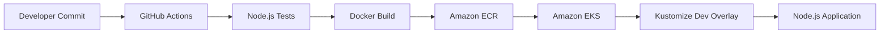

# Node.js CI/CD to Amazon EKS with GitHub Actions

> **Stage 3 of 12 — Career Progression Project**  
> Portfolio project by **Yugandhar Ethamukkala**.

This project demonstrates a complete Kubernetes-based CI/CD workflow for a Node.js application using **GitHub Actions, Docker, Amazon ECR, Amazon EKS, Terraform, Kubernetes, and Kustomize**.

## Career Progression Story

After building CI/CD with Jenkins and deploying containers to ECS Fargate, this project moves one step deeper into Kubernetes delivery using Amazon EKS. The goal is to show how an application can be tested, containerized, pushed to a registry, and deployed to a Kubernetes environment using a repeatable GitHub Actions pipeline.

## What This Project Demonstrates

- Node.js application build and unit testing.
- Docker image creation for a web application.
- Amazon ECR image publishing.
- Amazon EKS Kubernetes deployment.
- Kustomize overlays for `dev`, `staging`, and `prod` environments.
- Terraform-based EKS infrastructure foundation.
- Kubernetes health checks, rolling update strategy, resource limits, and cleanup steps.

## Tech Stack

`Node.js` `Jest` `Docker` `GitHub Actions` `Amazon ECR` `Amazon EKS` `Kubernetes` `Kustomize` `Terraform` `AWS`

## Architecture



## Repository Structure

```text
.
├── .github/workflows/e2ecicd.yaml
├── app/
│   ├── Dockerfile
│   ├── index.js
│   ├── calculator.js
│   ├── package.json
│   └── *.test.js
├── kustomize/
│   ├── base/
│   └── overlays/
│       ├── dev/
│       ├── staging/
│       └── prod/
├── terraform/
│   ├── main.tf
│   ├── variables.tf
│   ├── terraform.tf
│   └── outputs.tf
├── docs/screenshots/
├── README.md
└── REPO_UPLOAD_CHECKLIST.md
```

## Local Run

```bash
cd app
npm ci
npm test
npm run lint
docker build -t node-cicd-eks-gha:local .
docker run --rm -p 3000:3000 node-cicd-eks-gha:local
```

Open:

```text
http://localhost:3000
```

Health check:

```bash
curl http://localhost:3000/healthz
```

## Kubernetes Manifest Validation

```bash
kubectl kustomize kustomize/overlays/dev
kubectl kustomize kustomize/overlays/staging
kubectl kustomize kustomize/overlays/prod
```

## Terraform Validation

```bash
terraform -chdir=terraform fmt -recursive
terraform -chdir=terraform init
terraform -chdir=terraform validate
```

## GitHub Actions Secrets Needed

Only add these under GitHub repository secrets. Do not add them in code.

```text
AWS_ACCESS_KEY_ID
AWS_SECRET_ACCESS_KEY
AWS_REGION
```

Recommended value for this lab:

```text
AWS_REGION=us-east-1
```

The workflow expects an existing EKS cluster named:

```text
node-cicd-eks-dev
```

If your cluster name is different, update this value inside `.github/workflows/e2ecicd.yaml`:

```yaml
EKS_CLUSTER_NAME: node-cicd-eks-dev
```

## Deployment Flow

1. GitHub Actions checks out the code.
2. Node.js dependencies are installed.
3. Unit tests and syntax checks run.
4. Docker image is built.
5. Image is pushed to Amazon ECR.
6. GitHub Actions connects to Amazon EKS.
7. Kustomize `dev` overlay is updated with the new image.
8. Kubernetes deployment is applied and rollout status is checked.

## Screenshots

No ready screenshots were found in the uploaded source folder, so I added a screenshot guide.

After running the project, add these screenshots:

```text
docs/screenshots/github-actions-success.png
docs/screenshots/ecr-image-pushed.png
docs/screenshots/eks-cluster-running.png
docs/screenshots/kubectl-pods-service.png
docs/screenshots/application-output.png
docs/screenshots/terraform-destroy-success.png
```

## Cleanup / Cost Control

EKS can create AWS cost. Destroy resources after testing.

```bash
kubectl delete -k kustomize/overlays/dev --ignore-not-found=true
terraform -chdir=terraform destroy -auto-approve
aws ecr delete-repository --repository-name node-cicd-eks-github-actions --force || true
```

## Security Notes

- Do not commit AWS keys, `.env` files, kubeconfigs, Terraform state, or private keys.
- Store AWS access only in GitHub Actions secrets.
- Use short-lived lab credentials where possible.
- Destroy AWS resources after testing to avoid unwanted cost.

## How I Would Explain This in an Interview

I built this project to show a Kubernetes-based CI/CD deployment workflow for a Node.js application on Amazon EKS. The pipeline uses GitHub Actions to install dependencies, run tests, build a Docker image, push it to Amazon ECR, and deploy the latest version to an EKS cluster using Kustomize overlays.

This project helped me practice real DevOps tasks like container image versioning, Kubernetes manifests, environment-specific overlays, rollout validation, infrastructure provisioning with Terraform, and safe cleanup. It also helped me understand the difference between ECS managed container deployment and EKS Kubernetes-based deployment.

---

<p align="center">
  
</p>

<h2 align="center">🤝 Connect With Me</h2>

<p align="center">
  <em>
    Thanks for visiting this project! I’m continuously building hands-on DevOps, Cloud, Automation, and AI-enabled engineering projects to improve real-world deployment, monitoring, and infrastructure skills.
  </em>
</p>

<p align="center">
  
</p>

<p align="center">
  <a href="https://github.com/yugandhar99" target="_blank" rel="noopener noreferrer">
    
  </a>
  <a href="https://www.linkedin.com/in/yugandhar-devops" target="_blank" rel="noopener noreferrer">
    
  </a>
  <a href="https://yugandhar-portfolio-psi.vercel.app/" target="_blank" rel="noopener noreferrer">
    
  </a>
  <a href="mailto:yugandharethamukkala1999@gmail.com">
    
  </a>
</p>

<p align="center">
  
  
  
  
</p>

---

<p align="center">
  ⭐ If this project added value, feel free to star the repository and connect with me!
</p>

<p align="center">
  <strong>Built with ❤️ using modern DevOps practices</strong>
</p>


